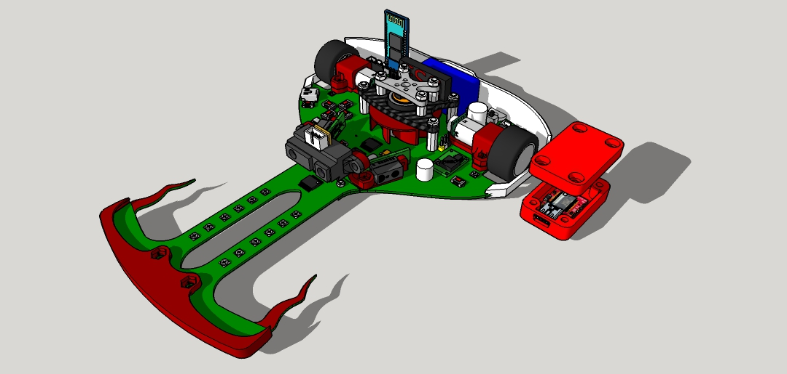

# DragonBot
Robot siguelineas con succión centrifuga y STM32F1

## Hardware
- STM32F1 "BluePill"
- Driver de motores TB6612FNG
- 2x Motores Pololu N20 HP @3000rpm
- 1x Motor Brushless Rotorx
- LiPo 2S ~250 mAh
- 12x Sensores QRE1113
- 12x Potenciometros para regular la ganancia de los sensores
- Ruedas Scaleauto Procomp 1
- Chasis de PCB autosoportado con soportes de motores, ventilador y parachoques impresos en PLA

## Software
- Programado con VSCode y PlatformIO
- Funciones de PID y cálculo de posición en la línea
- Disponibles programas para configuración por defecto, coreless y brushless en diferentes ramas secundarias